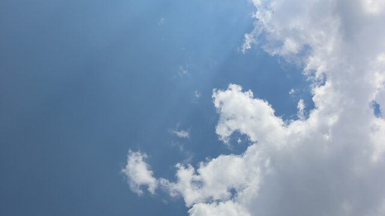
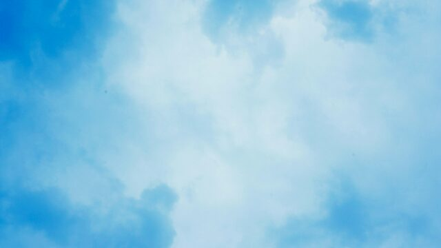
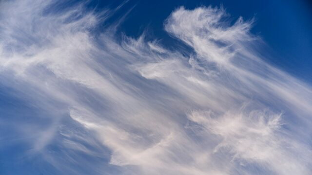
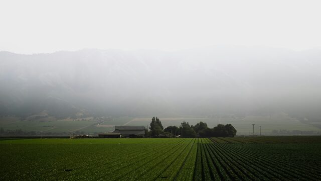
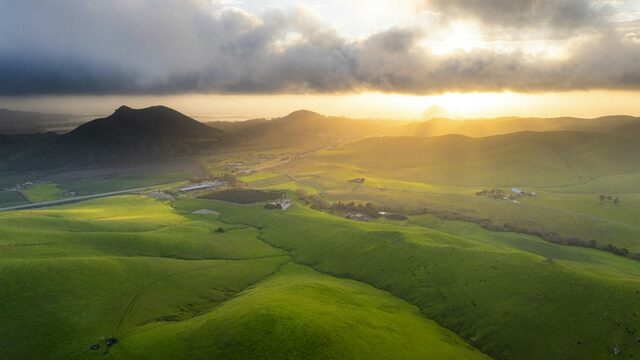

# Omarchy Sequoia Light Theme

A light macOS Sequoia theme for [Omarchy](https://omarchy.org): off-white
windows, system-gray chrome, and Apple System Blue `#007AFF`.


Lock screen: [preview-unlock.png](preview-unlock.png).

## Wallpapers

Five Unsplash skies and California hills. Thumbnails below; click for the
full 2560×1440 JPEG in `backgrounds/`.

| | |
| --- | --- |
| [](backgrounds/01-pale-sky.jpg) | [](backgrounds/02-soft-clouds.jpg) |
| [](backgrounds/03-cirrus.jpg) | [](backgrounds/04-california-fog.jpg) |
| [](backgrounds/05-morro-hills.jpg) | |

Photo credits are in [CREDITS.md](CREDITS.md). Cycle with `omarchy theme bg next`.

## Install

```bash
omarchy theme install https://github.com/hellwigio/omarchy-sequoia-light-theme
```

The menu name is `sequoia-light`. Icons are `Yaru-blue`. Palette is
[`colors.toml`](colors.toml). Terminal, Hyprland Lua, Neovim, and VS Code
configs are generated on the machine from that file — they are not shipped
in this repo.

## Palette

| Role | Hex |
| --- | --- |
| Background | `#F5F5F7` |
| Dark background | `#E8E8ED` |
| Darker background | `#D1D1D6` |
| Lighter background | `#FFFFFF` |
| Foreground | `#1D1D1F` |
| Accent | `#007AFF` |
| Selection | `#B3D7FF` |
| Selection foreground | `#1D1D1F` |
| Muted | `#8E8E93` |

Code is MIT ([LICENSE](LICENSE)). Wallpapers are [Unsplash License](https://unsplash.com/license).
